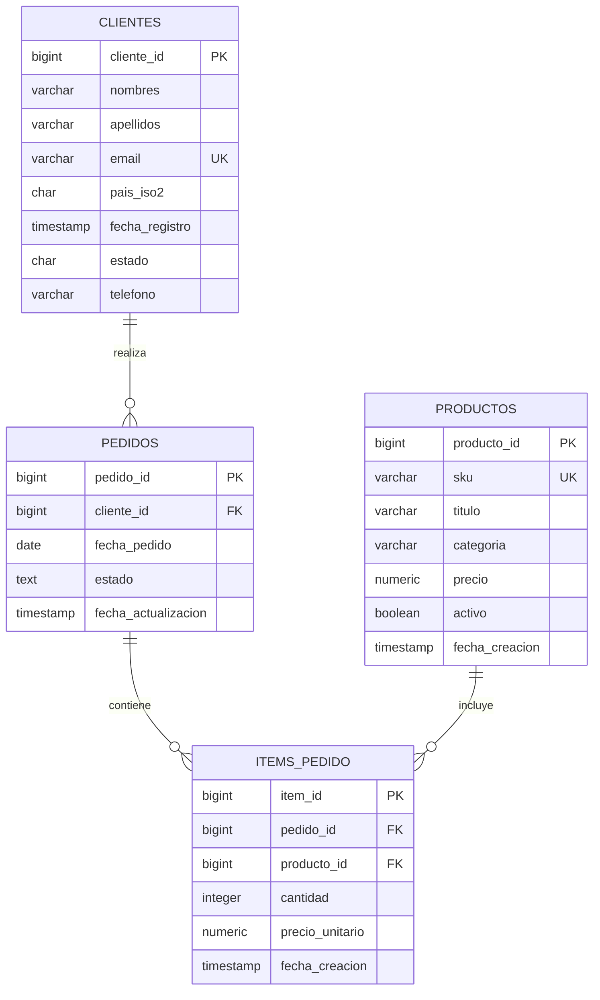

# Andina DB - Sistema de Ventas de Librería

## Descripción
Andina DB es un sistema de base de datos diseñado para una librería/editorial especializada en libros de tecnología y literatura andina. El sistema maneja clientes, productos, pedidos y items de pedidos con un enfoque en la integridad de datos y las mejores prácticas de PostgreSQL.

## Características del Sistema

### Modelo de Datos
- **4 tablas principales** con relaciones bien definidas
- **Integridad referencial** robusta con foreign keys
- **Restricciones de negocio** implementadas con CHECK constraints
- **Identificadores únicos** autoincrementales
- **Validaciones de datos** en múltiples niveles

### Funcionalidades
- Gestión de clientes con validación de países ISO2
- Catálogo de productos con SKUs únicos
- Sistema de pedidos con estados controlados
- Items de pedido con cálculos automáticos
- Reportes de ventas por cliente y producto

## Estructura de la Base de Datos

### Esquema: `ventas`

#### 1. Tabla `clientes`
```sql
cliente_id     BIGINT      PRIMARY KEY (autoincremental)
nombres        VARCHAR(100) NOT NULL
apellidos      VARCHAR(100) NOT NULL
email          VARCHAR(255) NOT NULL UNIQUE
pais_iso2      CHAR(2)      NOT NULL
fecha_registro TIMESTAMP    NOT NULL DEFAULT NOW()
estado         CHAR(1)      NOT NULL DEFAULT 'A'
telefono       VARCHAR(30)   NOT NULL
```

**Restricciones:**
- Email único
- Estado válido: 'A' (Activo) o 'I' (Inactivo)
- País en formato ISO2 alfabético

#### 2. Tabla `productos`
```sql
producto_id BIGINT       PRIMARY KEY (autoincremental)
sku         VARCHAR(50)  NOT NULL UNIQUE
titulo      VARCHAR(200) NOT NULL
categoria   VARCHAR(100) NOT NULL
precio      NUMERIC(12,2) NOT NULL
activo      BOOLEAN      NOT NULL DEFAULT TRUE
```

**Restricciones:**
- SKU único
- Precio >= 0
- Estado activo/inactivo

#### 3. Tabla `pedidos`
```sql
pedido_id    BIGINT      PRIMARY KEY (autoincremental)
cliente_id   BIGINT      NOT NULL (FK → clientes)
fecha_pedido DATE        NOT NULL DEFAULT CURRENT_DATE
estado       TEXT        NOT NULL DEFAULT 'PENDIENTE'
```

**Restricciones:**
- Cliente válido (FK)
- Estados válidos: 'PENDIENTE', 'PAGADO', 'ENVIADO', 'CANCELADO'

#### 4. Tabla `items_pedido`
```sql
item_id          BIGINT       PRIMARY KEY (autoincremental)
pedido_id        BIGINT       NOT NULL (FK → pedidos)
producto_id      BIGINT       NOT NULL (FK → productos)
cantidad         INTEGER      NOT NULL
precio_unitario  NUMERIC(12,2) NOT NULL
```

**Restricciones:**
- Pedido y producto válidos (FK)
- Cantidad > 0
- Precio unitario >= 0
- Combinación pedido-producto única

## Relaciones



**Relaciones:**
- Un cliente puede tener múltiples pedidos
- Un pedido puede tener múltiples items
- Un producto puede estar en múltiples items de diferentes pedidos
- Eliminación en cascada: pedido → items_pedido

## Instalación y Configuración

### Requisitos
- PostgreSQL 12+ 
- Cliente de base de datos (psql, DBeaver, pgAdmin, etc.)

### Instalación
```bash
# Conectar a PostgreSQL
psql -U postgres

# Ejecutar el script de creación
\i andina.ddl
```

### Verificación
```sql
-- Verificar tablas creadas
\dt ventas.*

-- Verificar datos de ejemplo
SELECT COUNT(*) FROM ventas.clientes;
SELECT COUNT(*) FROM ventas.productos;
SELECT COUNT(*) FROM ventas.pedidos;
SELECT COUNT(*) FROM ventas.items_pedido;
```

## Consultas de Ejemplo

### Consultas Básicas
```sql
-- Clientes de Perú
SELECT cliente_id, nombres, apellidos, email
FROM ventas.clientes
WHERE pais_iso2 = 'PE'
ORDER BY cliente_id;

-- Productos de tecnología con precio >= 100
SELECT producto_id, titulo, precio
FROM ventas.productos
WHERE categoria = 'Tecnología' AND precio >= 100
ORDER BY precio DESC;
```

### Consultas con JOINs
```sql
-- Vista completa de pedidos
SELECT ip.item_id,
       p.pedido_id,
       c.nombres || ' ' || c.apellidos AS cliente,
       pr.titulo AS producto,
       ip.cantidad,
       ip.precio_unitario,
       (ip.cantidad * ip.precio_unitario) AS subtotal,
       p.estado
FROM ventas.items_pedido ip
JOIN ventas.pedidos p ON p.pedido_id = ip.pedido_id
JOIN ventas.clientes c ON c.cliente_id = p.cliente_id
JOIN ventas.productos pr ON pr.producto_id = ip.producto_id
ORDER BY p.pedido_id, ip.item_id;
```

### Agregaciones
```sql
-- Ingresos por cliente (solo quienes superan S/ 200)
SELECT c.cliente_id,
       c.nombres || ' ' || c.apellidos AS cliente,
       SUM(ip.cantidad * ip.precio_unitario) AS total_cliente
FROM ventas.clientes c
JOIN ventas.pedidos p ON p.cliente_id = c.cliente_id
JOIN ventas.items_pedido ip ON ip.pedido_id = p.pedido_id
GROUP BY c.cliente_id, cliente
HAVING SUM(ip.cantidad * ip.precio_unitario) > 200
ORDER BY total_cliente DESC;
```

## Operaciones DML

### INSERT
```sql
-- Insertar nuevo cliente
INSERT INTO ventas.clientes (nombres, apellidos, email, pais_iso2, telefono)
VALUES ('Carlos', 'Mendoza', 'carlos.mendoza@example.com', 'CO', '555-0123')
RETURNING *;
```

### UPDATE
```sql
-- Actualizar precio de producto
UPDATE ventas.productos
SET precio = precio * 1.10
WHERE sku = 'BK-SQL-101'
RETURNING producto_id, sku, precio;
```

### DELETE (con transacción)
```sql
BEGIN;
DELETE FROM ventas.pedidos WHERE pedido_id = 2;
-- Los items se eliminan automáticamente por CASCADE
COMMIT;
```

## Buenas Prácticas Implementadas

### Integridad de Datos
- **Primary Keys** autoincrementales para identificadores únicos
- **Foreign Keys** con restricciones ON DELETE CASCADE/RESTRICT
- **UNIQUE constraints** para campos críticos (email, SKU)
- **CHECK constraints** para validaciones de negocio
- **NOT NULL** para campos obligatorios

### Seguridad
- **Transacciones** para operaciones críticas
- **RETURNING** para confirmar cambios
- **WHERE específicos** en UPDATE/DELETE
- **Validación previa** con SELECT

### Mantenibilidad
- **Nombres descriptivos** para tablas y columnas
- **Comentarios** en el código
- **Estructura modular** del script
- **Datos de prueba** incluidos

## Casos de Uso

### E-commerce
- Gestión de catálogo de productos
- Procesamiento de pedidos
- Control de inventario
- Reportes de ventas

### Análisis de Negocio
- Ventas por cliente
- Productos más vendidos
- Ingresos por período
- Análisis geográfico (por país)

### Administración
- Gestión de clientes
- Control de estados de pedidos
- Actualización de precios
- Mantenimiento de datos

## Datos de Ejemplo

El sistema incluye datos de prueba:
- **4 clientes** de diferentes países (PE, CL, MX)
- **5 productos** de tecnología y literatura
- **3 pedidos** con diferentes estados
- **Items de pedido** con cálculos de subtotales

## Extensibilidad

### Posibles Mejoras
- Tabla de categorías normalizada
- Sistema de descuentos
- Historial de cambios de precios
- Auditoría de transacciones
- Integración con sistemas de pago

### Escalabilidad
- Índices en campos de búsqueda frecuente
- Particionamiento por fecha
- Replicación para alta disponibilidad
- Optimización de consultas complejas

## Soporte

Para consultas o mejoras al sistema, revisar:
- Documentación de PostgreSQL
- Mejores prácticas de diseño de bases de datos
- Patrones de integridad referencial

---
**Versión**: 1.0  
**Última actualización**: 2024  
**Compatibilidad**: PostgreSQL 12+
